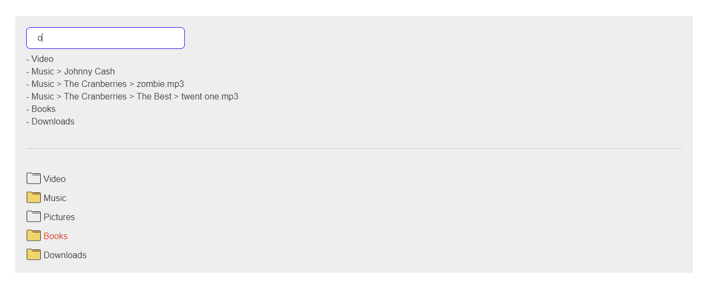

# Files-App

Spendbase - test task. Create UI for work with files and folders

# Description
- file [./src/data.json](./src/data.json) contains all structure of folders and files, it's linear array of objects. You can create any deep and quantity of elements. I build tree view by recursion algorithm. Empty folders have special icons, also forbidden folders and files marked by red color of label.
- move node to another parent - it can be implemented through changing parent_id field in any node
- remove node - it can be implemented through recursion - just get ids of all children and remove them
- productivity and performance - I think we should add fetch requests for getting children of each parent node by click, we don't need to show all structure on start, so this is the way to improve performance (we will need to add one more field to our structure - childrenQuantity - for indicate empty folders).

# Environment
- node v20.11.1
- npm v10.2.4

# How to run locally
1. clone this repository
  - git clone https://github.com/lysenko86/files.git
2. go to project folder and install packages
  - npm install
3. run project locally
  - npm run start
4. it should be started here
  - http://localhost:3000/
